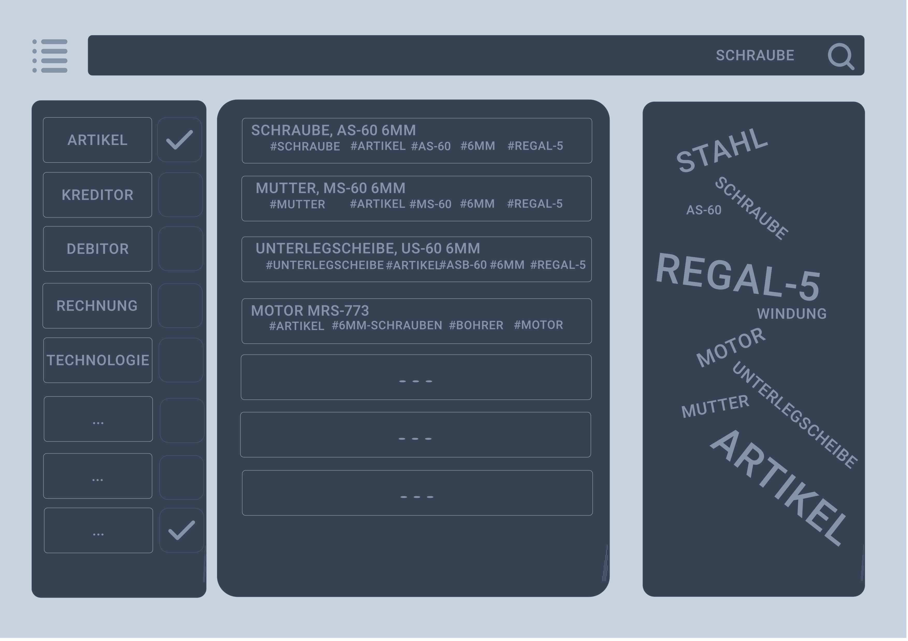

<!-- ## Anforderungsanalyse -->

Während den ersten zwei Gruppenmeetings wurden die Anwendungsfälle für Folksonomien, Social
Tagging und Tag-Clouds im ERP-System von TecWare ausgearbeitet. Anhand dessen wurden folgende Prinzipsskizzen erstellt, wie auch Anforderungen schriftlich formuliert. Folgene Ergebnisse wurden dabei erzielt:

## Prinzipskizzen:

1. Prinzipskizze 

2. Prinzipskizze 

3. Prinzipskizze 

## Anforderungen:

**Glossar**:

Systemtags: Tags, die bei Erstellung eines Objekts vom System generiert werden.
Usertags: Tags, die vom User selbst erstellt und an das Objekt angehangen werden. 
Tags: 	Menge aller System- und Usertags.

Klassifikation: 
    0 = Text
		1 = Datum
		2 = Nummer

**System**:

Das System muss in der Lage sein, eine Vielzahl von Tags anzuzeigen. 
Das System muss in der Lage sein, nach bestimmten Tags zu filtern 
Das System muss in der Lage sein, eine Liste von Objekten (Bestellnummer, Artikel, Artikelnummer, Kundennummer) zu verkleinern, nachdem nach einem bestimmten Tag gefiltert wurde. 
Das System muss in der Lage sein, einem Objekt Systemtags anzuhängen. 
Das System muss in der Lage sein, aus den in der Liste angezeigten Tags, eine WordCloud zu generieren und anzuzeigen. 
Das System muss in der Lage sein, Systemtags zu klassifizieren.  
Das System muss in der Lage sein, zu einem einzelnen Objekt eine WordCloud zu generieren. 
Das System muss in der Lage sein, in der Eingabemaske eine alphabetische Sortierung vorzunehemen. 
Das System muss in der Lage sein, eine Filterliste in der Suchleiste zu generieren. 
Das System muss in der Lage sein einen Suchverlauf anzuzeigen. 

**Nutzer**:

Der Nutzer muss in der Lage sein, nach Schlagworten in einer Eingabemaske zu suchen. 
Der Nutzer muss in der Lage sein, eigene Tags an ein Objekt hinzuzufügen. 
Der Nutzer muss in der Lage sein, Tags in der WordCloud ausblenden zu können. 
Der Nutzer muss in der Lage sein, eigene Usertags zu ändern/löschen. 
Der Nutzer muss in der Lage sein, Usertags zu klassifizieren. 
Der Nutzer muss in der Lage sein, durch eine Interaktion einen Tag als Filter zu setzen. 
Der Nutzer muss in der Lage sein, einen Tag auszuwählen. 
Der Nutzer muss in der Lage sein, durch eine Interaktion einen Tag auszublenden. 

**Administrator**:

Der Administrator muss in der Lage sein, Tags zu ändern / löschen.

## Entwurf der GUIs zur Eingabe von Tags:

Um eine Vorstellung von der zukünftigen Oberfläche des ERP - Systems zu bekommen, wurden von den Studenten grafisch fünf GUIs entworfen. Diese sollten der Eingabe von Tags für sogenannte Datenobjekte dienen.
Die Aufgabe der Studenten bestand darin, sich eine Form der Eingabemöglichkeit für Tags zu überlegen wobei auch neue
Dialoge entstehen können. Die Ergebnisse wurden im Gruppenmeeting präsentiert und deren Verwendung, im Austausch mit Herrn Stein  diskutiert. 

1. Inline – vs. Popup – Editor
<pre><pre><pre>   
2. Beispielmaske (ohne Tag Eingabe)
<pre><pre><pre>   
3. Beispielmaske (mit Inline – Tag Eingabe)
  <pre><pre><pre> 
4. Beispielmaske (mit Popup – Tag Eingabe)
  <pre><pre><pre> 
5. Twitter – like“ Textbox (Inline)
<pre><pre><pre>   
6. IDE – like“ Editor (Inline)
 <pre><pre><pre> 
7. Evernote – like“ Tagbox (Inline)
<pre><pre><pre>  
8. Classic“ Listbox (Popup)
<pre><pre><pre>  

